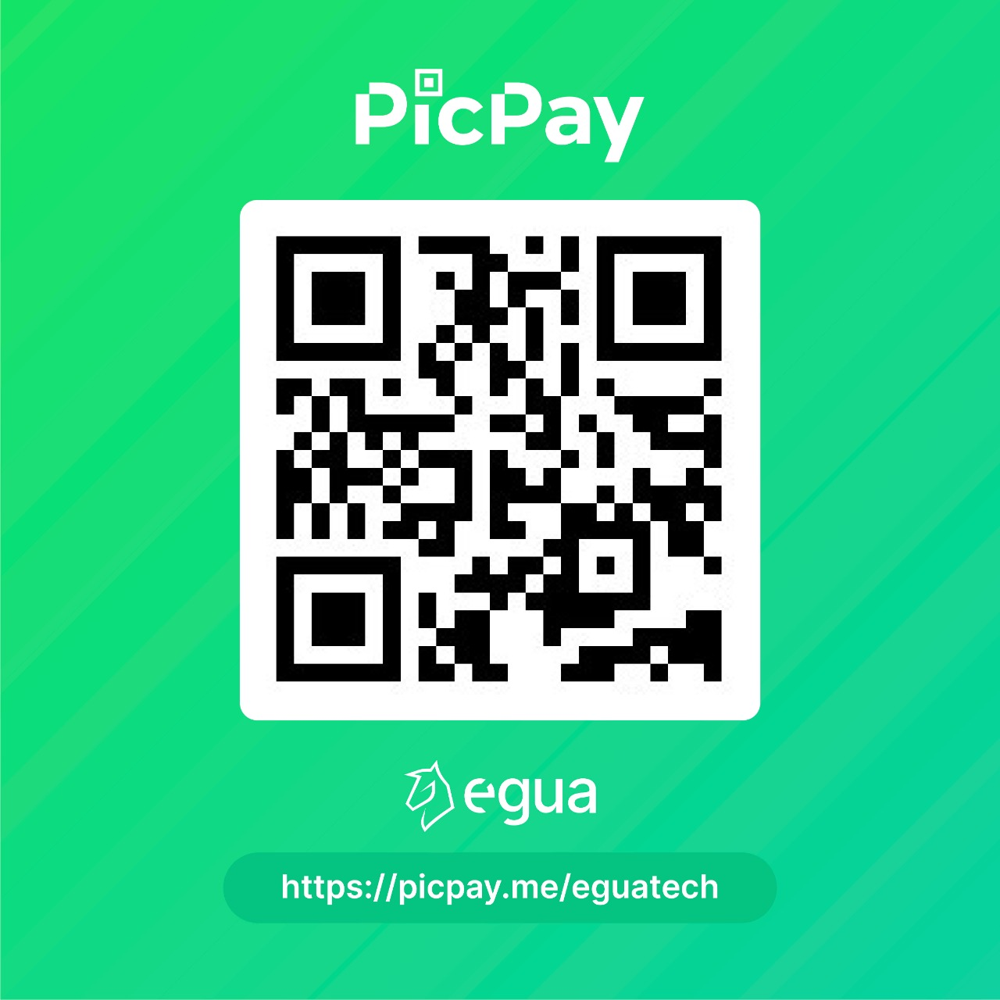

<br>
<p align="center">
  

  <h3 align="center">Linguagem Egua</h3>

  <p align="center">
    Linguagem de programação simples e moderna.
    <br />
    <a href="https://egua.tech/docs/egua" target="_blank"><strong>Documentação »</strong></a>
    <br />
    <br />
    <a href="https://egua.tech/egua/" target="_blank">IDEgua</a>
    ·
    <a href="https://github.com/eguatech/egua/issues" target="_blank">Reportar Bug</a>
    ·
    <a href="https://github.com/eguatech/egua/issues" target="_blank">Solicitar Funcionalidade</a>
    <br />
    <br />
    
    
    
    
    
    <br>
    <a href="https://github.com/eguatech" target="_blank">
    <a href="https://twitter.com/eguatech" target="_blank"> 
    <a href="https://www.instagram.com/eguatech/" target="_blank">
    <a href="https://www.youtube.com/channel/UCDgGUdR_6hZ6lfVaQbkQPLw" target="_blank">
    <a href="https://www.linkedin.com/company/eguatech/" target="_blank"> </a>
    <a href="https://dev.to/eguatech" target="_blank"> </a>
  </p>
</p>

## Introdução

- **Simples e Completa.** Podendo ser usadas por pessoas com ou sem experiência em programação.
- **Totalmente em Português.** Desenvolvida totalmente em português para quebrar a barreira do inglês.
- **Grátis.** Sem planos, sem limitações e sem propaganda.
- **Código aberto (open-source).** Todo código fonte disponível para estudar, modificar e contribuir.
- **Constantes Atualizações.** Junto à nossa comunidade, para trazermos melhorias e inovações.
- **Linguagem Científica.** Apoiamos e encorajamos o desenvolvimento e aprimoramento da ciência e da educação.

## Instalação

- Apenas visite o [IDEgua](https://egua.tech/egua/) e comece a programar.

### Usando como LAIR (Leia-Avalie-Imprima-Repita) em console

[Você deve ter o Node.js instalado em seu ambiente](https://dicasdejavascript.com.br/instalacao-do-nodejs-e-npm-no-windows-passo-a-passo). 

Com o Node.js instalado, execute o seguinte comando em um prompt de comando (Terminal, PowerShell ou `cmd` no Windows, Terminal ou `bash` em Mac e Linux):

```
npm install -g egua
```

Feito isso, execute o seguinte comando:

```
egua
```

Você terá um interpretador Egua que avalia expressões linha a linha. 

Para finalizar a execução do interpretador LAIR Egua, use o atalho <key>Ctrl</key> + <key>C</key> (todos os sistemas operacionais).

## Documentação

- Para acessar nossa documentação, visite o [site de documentação](https://egua.tech/docs).

## Contruibuições

* Para contribuições, por favor, leia o nosso [Guia de Contribuição](.github/CONTRIBUTING.md) antes de submeter uma Pull Request.

## Apoie-nos!

- Se você gosta do nosso trabalho e quer nos apoiar, agora você pode através do nosso PicPay ou PayPal! Você pode nos ajudar com doações mensais ou únicas. Acesse agora usando o QR Code ou clicando na imagem abaixo.
- Tem mimos pra quem apoiar, e virão mais no futuro!

<p align="center">
  <a href="https://www.paypal.com/donate?business=L6W3VGTKZPPK6&item_name=Sua+doa%C3%A7%C3%A3o+contribui+para+que+eu+possa+seguir+desenvolvendo+projetos+de+c%C3%B3digo+aberto+como+a+Linguagem+Egua&currency_code=BRL" target="_blank">
  
  </a>
</p>

<p align="center">
  <a href="https://picpay.me/eguatech" target="_blank">
    
  </a>
</p>

- **A linguagem Égua é um projeto open-source que se faz possível com o empenho da nossa apaixonada equipe de desenvolvedores, talentoso colaboradores e apoiadores. Obrigado a todos!**
- **Em caso da necessidade de um contato mais pessoal envie email para `lucaspompeuneves@gmail.com` ou [entre aqui](https://egua.tech/comunidade)**
